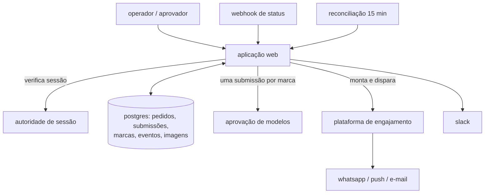
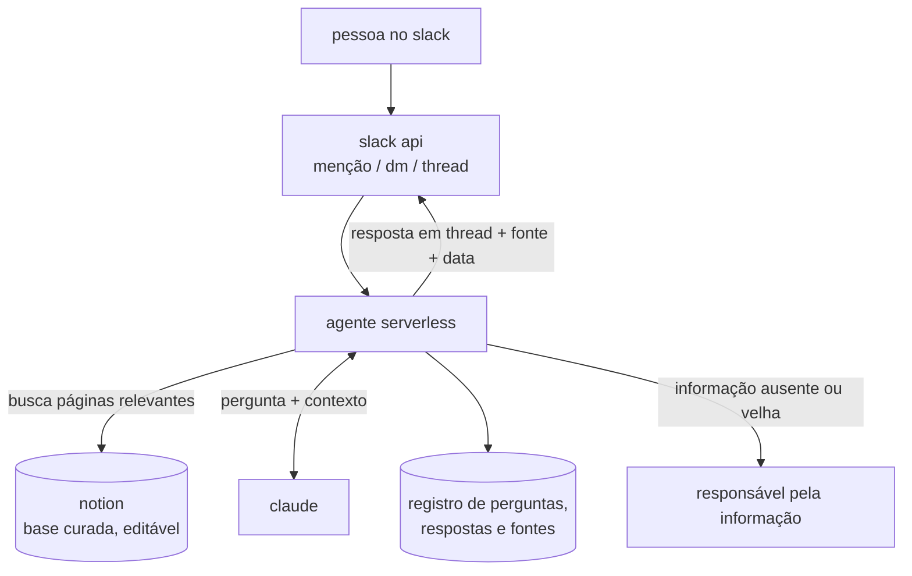

# byte e oráculo

Dois produtos internos em produção na robbin, uma fintech de crédito. construídos entre julho e agosto de 2026, nos meus primeiros dois meses programando, com agentes de código como ferramenta principal.

o código é privado (propriedade da empresa). este repositório descreve o que foi construído, como e por quê. detalhes de negócio, parceiros, identificadores e dados de carteira foram omitidos.

---

## byte — comunicações multi-marca em um só lugar

### o problema

a robbin opera comunicações para várias marcas parceiras, em três canais: whatsapp, push e e-mail. antes, cada modelo de mensagem precisava ser criado conta a conta — com seis contas de whatsapp, um mesmo texto virava até seis submissões, seis aprovações para acompanhar e seis disparos para montar à mão. o processo dependia de uma pessoa que dominava as regras do provedor. o gatilho para construir foi ela entrar de férias.

### o que faz

escreve uma vez, publica para todas as marcas.

- **redação guiada.** o operador escolhe a *intenção* em português ("promoção", "lembrete de pagamento") e a ferramenta traduz para a categoria técnica do provedor, avisando risco de rejeição e diferença de custo. variáveis vêm de um catálogo nomeado, nunca marcadores numéricos digitados à mão.
- **uma submissão por marca, automática.** mesmo nome de modelo, variando só assinatura e imagem por marca.
- **matriz pedido × marca.** o que está aprovado, pendente, rejeitado — e, distinto disso, onde o pedido nem existe. cada linha mostra a próxima ação concreta.
- **status que volta sozinho.** webhook (segundos) e reconciliação agendada (minutos), redundantes por desenho, porque o provedor pode desativar o webhook em silêncio.
- **e-mail por blocos.** título, texto, lista, destaque, botão, tabela, imagem — com prévia por marca mostrando cores, logo e valores de exemplo, sem código de template.
- **push com destino.** tela do app escolhida de um catálogo de rotas, com simulação de como chega no aparelho.
- **disparo pela própria ferramenta.** seleção de segmentos, contagem real de destinatários, envio de teste, envio real.
- **auditoria.** quem fez o quê, quando, por qual origem.

### safeguards

a parte que mais me importa. toda decisão irreversível passa por humano; tudo que pode falhar em silêncio foi transformado em falha alta.

- validação de conteúdo compartilhada entre navegador e servidor — a mesma função dos dois lados, para a tela nunca aceitar o que o servidor recusa.
- limites de caracteres por canal, cada um justificado por onde o cliente final corta o texto.
- portão de revisão humana antes de submeter (o provedor não tem rascunho: criar já é submeter).
- guarda atômica contra duplo clique — dois cliques não criam dois modelos permanentes.
- segunda aprovação opcional, com proibição de auto-aprovação.
- três travas no envio: recusa reenvio do que já saiu; a contagem aprovada na tela precisa bater com a do momento do clique (segmentos dinâmicos mudam nessa janela); acima de 5.000 destinatários a confirmação é reforçada.
- envio de teste com teto rígido de 50 — teste e disparo real usam o mesmo mecanismo; um "teste" sem teto seria o disparo com rótulo tranquilizador.
- aviso de cobertura de atributos: se a mensagem cita um dado que parte do público não tem, avisa antes — essas entregas falham uma a uma enquanto o agregado reporta sucesso.
- imagem validada pela assinatura binária, não pelo tipo declarado pelo navegador.
- configuração de marca incompleta faz a operação falhar, em vez de entregar uma peça sem assinatura e contar como sucesso.
- assinatura e descadastro são estruturais, não blocos que alguém pode esquecer.
- verificação de sessão contra a autoridade central antes de qualquer escrita em provedor externo.

### arquitetura

next.js 15 (app router) · react · typescript · tailwind · postgres serverless com orm tipado e migrações · hospedagem serverless com tarefas agendadas · sso corporativo.

integrações: plataforma de aprovação de modelos do whatsapp (meta) · customer.io como roteador e registro de tudo que é disparado · slack para avisos de status. a credencial do provedor de conversação nunca entra nesta ferramenta — fica na plataforma de engajamento.

### números

- 13 dias do primeiro ao último commit (01–13/08/2026)
- 97 commits · 56 pull requests · 37 versões taggeadas (0.1.0 → 0.25.0)
- ~25 mil linhas de typescript/tsx · 8 tabelas · 7 páginas · ~31 componentes
- 26 arquivos de teste · ~546 casos, incluindo 3 suítes de integração com postgres embutido exercitando transações concorrentes
- 84 dos 97 commits coautorados por agente de código

### sobre ia

o byte foi **construído com** ia, mas **não usa** ia em produção. traduzir intenção em categoria, sugerir variáveis, decidir status a partir de duas fontes — tudo é regra determinística e testada. não coloquei um modelo onde uma regra resolvia.

---

## oráculo — fonte da verdade da empresa no slack

### o problema

o conhecimento sobre marcas parceiras e regras de negócio vivia na cabeça de algumas pessoas e, parcialmente, no slack. Quando alguém sai da empresa, o conhecimento ia junto.

### o que faz

um agente no slack que responde perguntas de negócio com a resposta oficial e a fonte.

- **está onde o time já está.** menção em qualquer canal ou dm; responde sempre em thread; mantém o contexto da thread para perguntas encadeadas.
- **procedência em toda resposta.** cada resposta traz a página-fonte, a data da última atualização e o responsável pela informação.
- **não chuta.** se não entende a pergunta, pede clarificação. se a informação não existe na base, diz que não existe — e avisa o responsável no slack pedindo atualização.
- **consultas cruzadas.** comparações entre marcas na mesma pergunta, viabilizadas pela estrutura padronizada das páginas.
- **base editável por qualquer pessoa.** as páginas vivem no notion, com template padronizado por marca e por domínio (comercial, crédito, atendimento, operação).
- **o agente também cura.** o agente detecta páginas desatualizadas e cobra o responsável, e/ou propõe edições que um humano aprova — confirmar o que ele escreve de fato --> mantém a base viva em vez de deixá-la envelhecer

### safeguards

um agente que responde regra de crédito errada com confiança é pior do que nenhum agente. os safeguards existem para isso.

- **só responde com base na base.** o modelo recebe as páginas relevantes do notion como contexto e é instruído a responder apenas a partir delas; sem página que sustente, a resposta é "não tenho essa informação", não uma inferência.
- **fonte obrigatória.** resposta sem página-fonte não é entregue. 
- **clarificação antes de resposta ambígua.** perguntas que casam com mais de uma marca ou mais de um domínio geram pergunta de volta, não resposta genérica.
- **o agente não edita a base sozinho.** toda alteração em página passa por humano.
- **escopo restrito ao workspace da empresa.** o app do slack só responde dentro do workspace; o token do notion só alcança o espaço da base de conhecimento.
- **registro de uso.** cada pergunta e resposta é registrada com quem perguntou, em qual canal, quando, e quais páginas foram usadas — base do tracking de adoção e do ciclo de evals.
- **dono definido.** um responsável por marca, contribuidores por área, e cobrança automática quando a informação envelhece.

### arquitetura

notion como base de conhecimento (escolhido sobre docs + rag pela editabilidade por não-técnicos) · agente em typescript hospedado em plataforma serverless · claude como modelo · slack api (eventos de menção e dm, resposta em thread) · notion api para leitura das páginas

### números

- ~6 mil linhas de typescript
- base inicial com 7 marcas e ~15 categorias de informação priorizadas com o time comercial 
- aberto para toda a empresa; adoção medida por usuários únicos por semana

### sobre ia

diferente do byte, o oráculo **usa** ia em produção — e o desenho inteiro é sobre restringir o que ela pode fazer. o modelo interpreta a pergunta, seleciona e sintetiza páginas da base, e formula a resposta. ele não decide o que é verdade: a verdade está no notion, escrita e revisada por pessoas. onde uma regra resolvia (roteamento de canal, registro, cobrança de responsável), usei regra.
